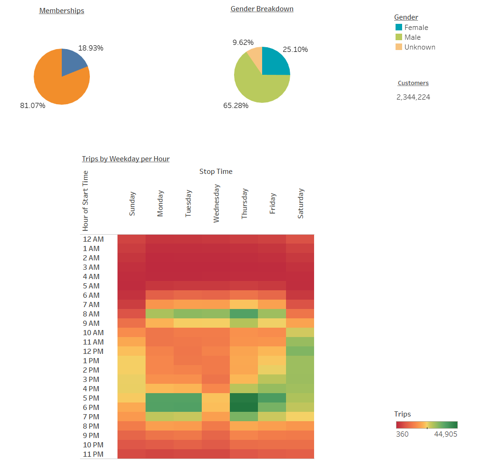
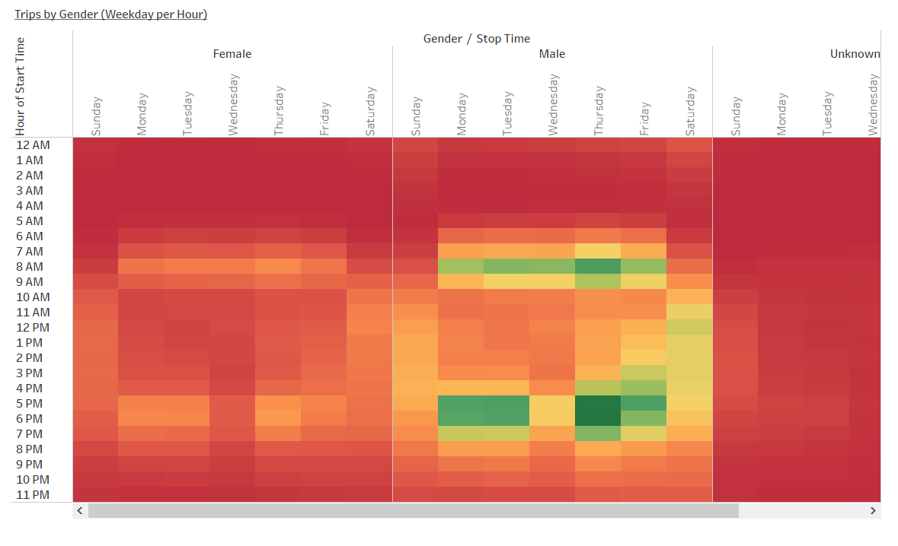
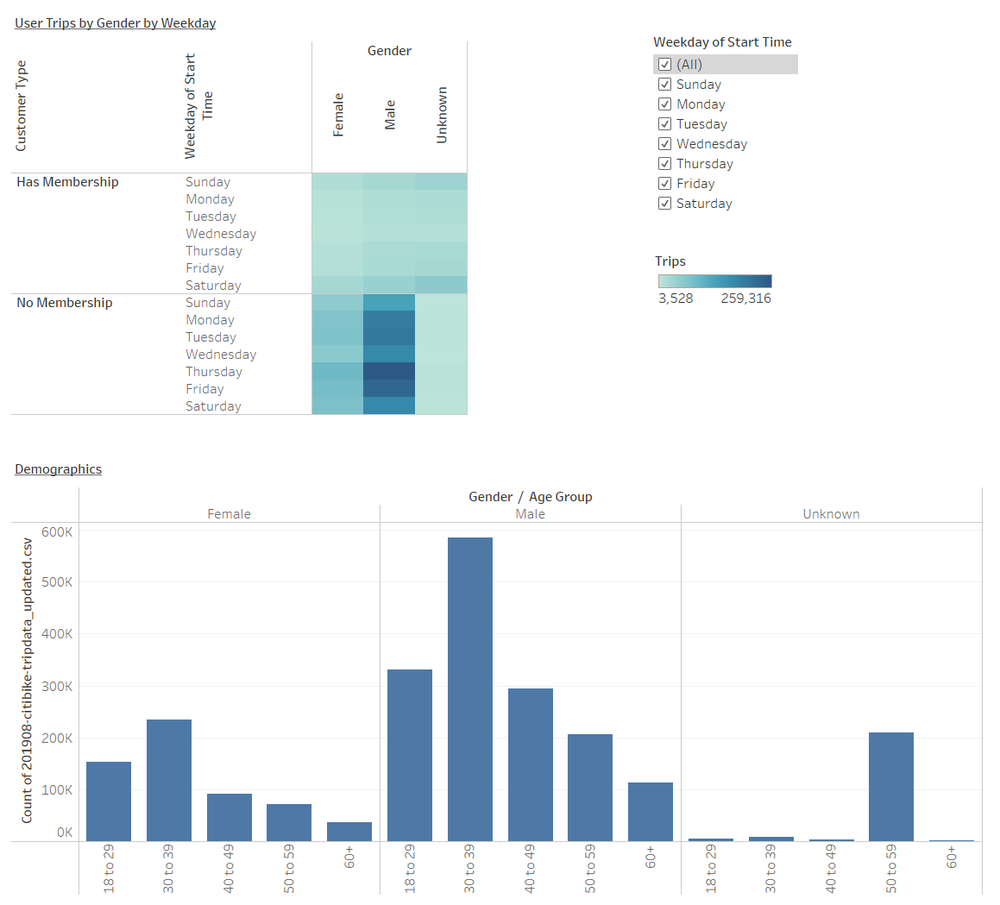
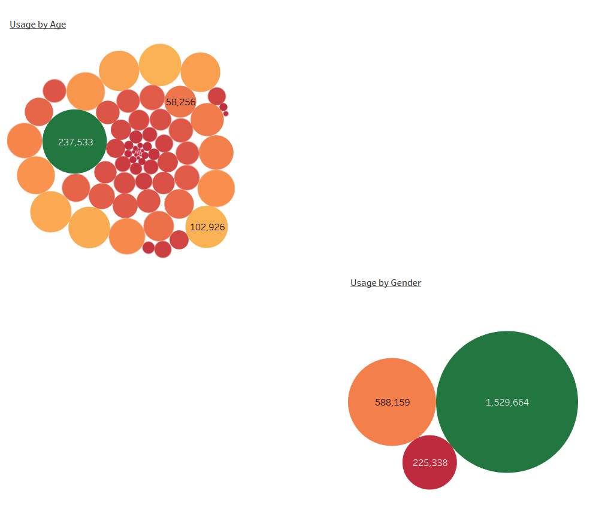
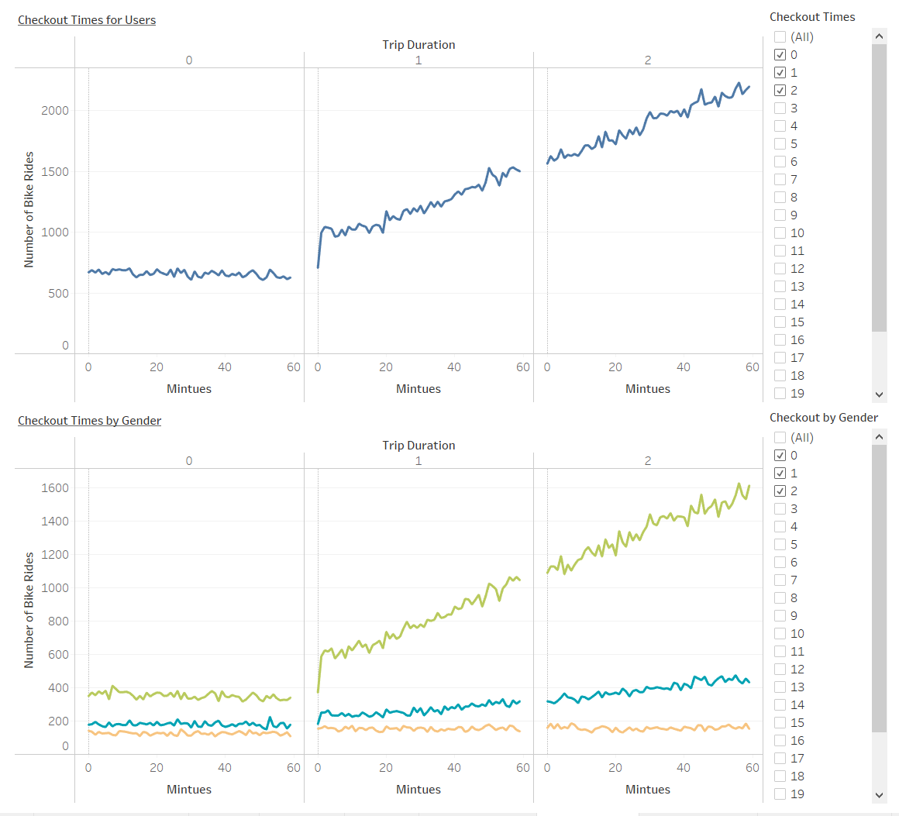

# Bike Sharing Proposal
## Overview
This proposal to entice investors for a Bike Sharing business in Des Moines, IA.  The analysis looks at data from New Youk City and how successful the program is and what the trends are regards to the program.  The goal is to determine whether or not it is a viable investment for Des Moines.

## Results
In New York City, the program is very popular.  It is more popular with men with 65% ridership and what appears to be through tourism as 81% of the rides are from people who do not have a rideshare membership.  

Ridership times have high usage during typical commute times and Saturdays.  This would give opportunity to swap the bikes for maintenance during off peak hours. 

The next three charts show more detail on ridership by gender.  You can see that males ride the bikes more tha females.  Ridership is higher during commute hours for both male and female; however, males are higher.

Looking at various age groups the ride share is most popular between the ages of 30 to 39 years old for both men and women.  It does appear that the 50- to 59-year-olds do not want to disclose their gender. This could impact the results, but not significantly.  

We looked at checkout times and how long the bikes were used to see if it would impact when maintenance will need to be completed.  This chart is interactive so that you can see usage based on when the bike was checked out.

## Summary
Bike Sharing allows people to explore the city, get to know the people who live in the city.  It also allows people to use the bikes for their commutes to and from work.  There is the potential that this would be profitable in Des Moines, but more research is needed. Further analysis is needed as we do not have financials from the bike share company.  This would be needed to fully understand potential profitability and capital needs.